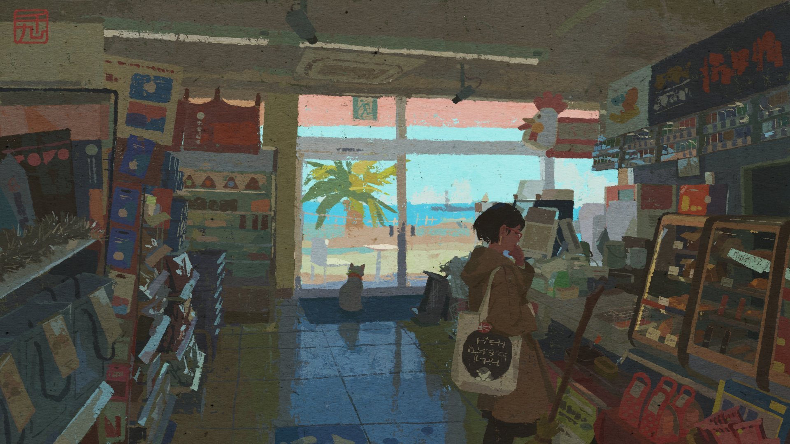
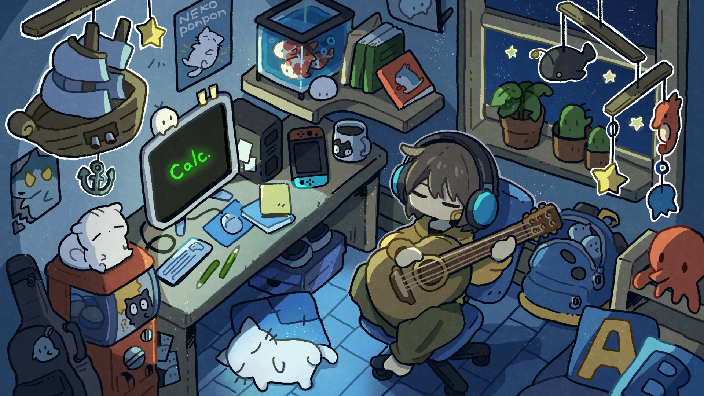
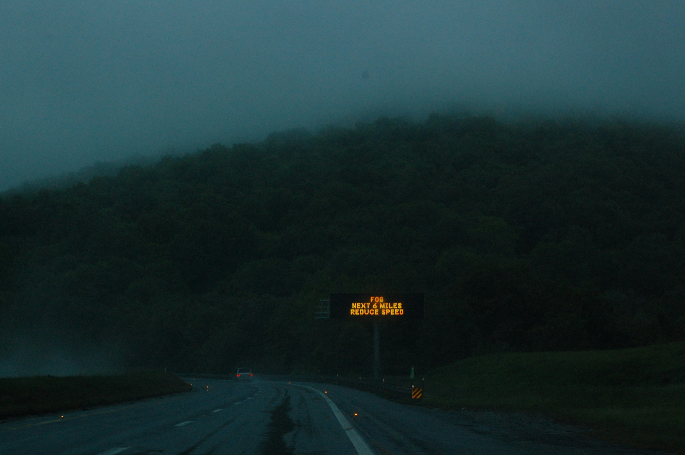
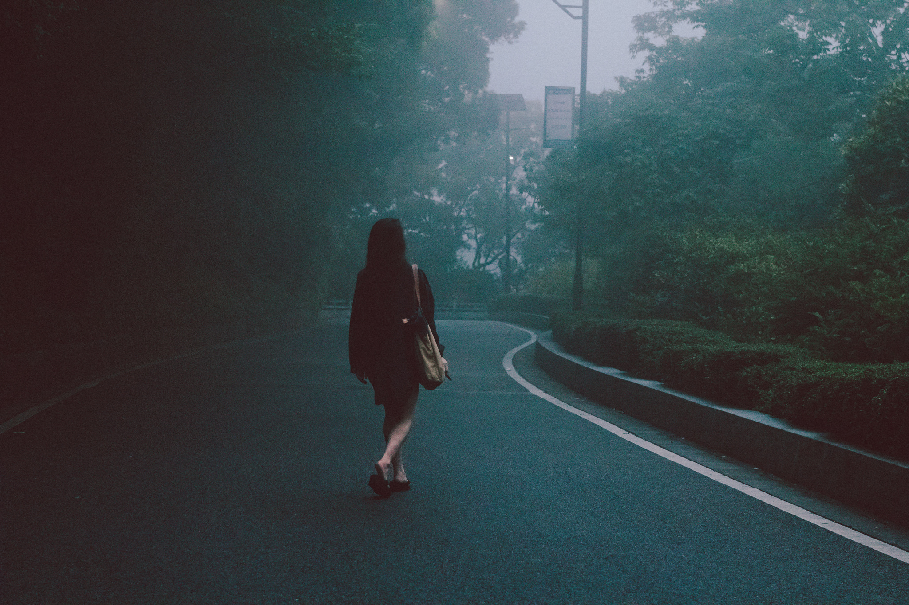
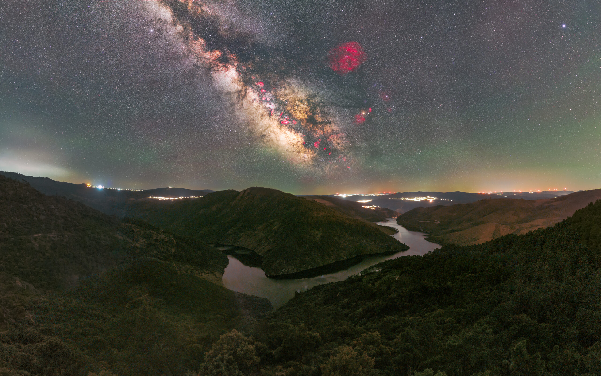

<h1 align=center>Disclaimer</h1>
I do not own any of the original works featured in this repository. This collection is for personal use and sharing purposes only. I strive to attribute all artworks to their rightful creators. If you are the owner of any content and wish to have it removed, just let me know!

<h1 align=center>Fine Art</h1>

### Charles William Wyllie - *The Back Water*

### William Merritt Chase - *At the Seaside*

### John Singer Sargent - *Carnation, Lily, Lily, Rose*

<h1 align=center>Illustrations</h1>

### [Neo1900] - *Seaside Mart*

### [Shimarisu Yukichi]

### [Justin Bodnar] - *Dreamlike Serenity*

<h1 align=center>Photography</h1>

### [Joe Woods] - *Grey Highway*

### [Louis Hvejsel Bork]

### [José Rodrigues] - *Milky Way over the Tua Valley*

[Neo1900]: https://xcancel.com/neo1900art
[Shimarisu Yukichi]: https://xcancel.com/yukichi_nya___
[Justin Bodnar]: https://www.behance.net/justin
[Joe Woods]: https://unsplash.com/@woods
[Louis Hvejsel Bork]: https://www.flickr.com/photos/32821471@N04/
[José Rodrigues]: https://imginn.com/joserodrigues.space

